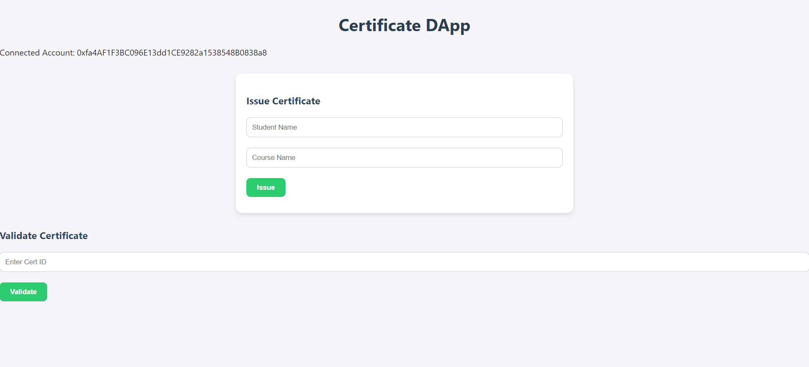
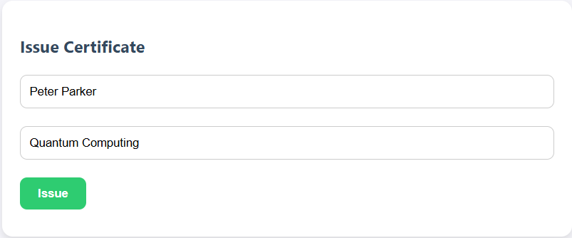
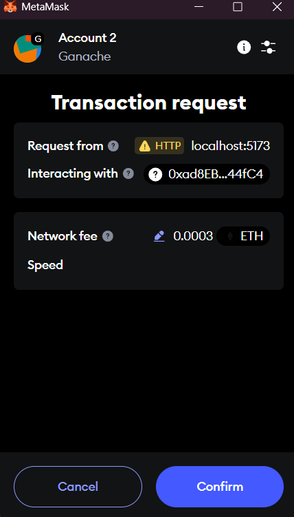
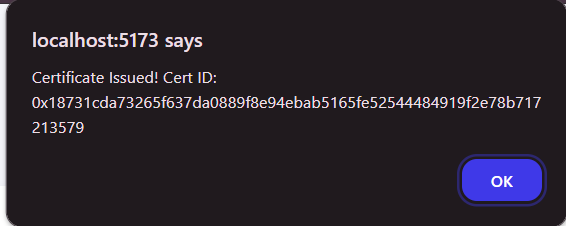
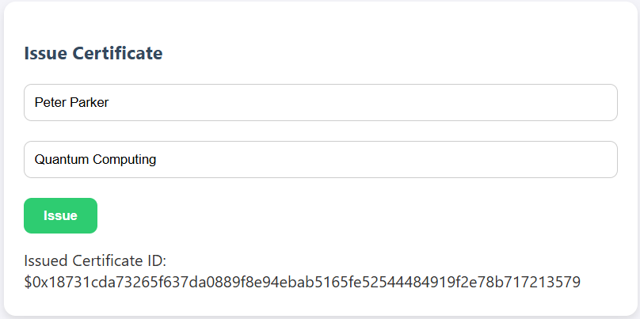

# Blockchain Certificate DApp

This is a decentralized application (DApp) that enables educational institutions to issue and validate academic certificates using **blockchain technology**. Built with **React**, **Vite**, and **Solidity**, this project demonstrates how blockchain can be used in the education sector to prevent certificate fraud and simplify the verification process.

---

## Tech Stack

- **React 18** – Frontend framework  
- **Vite** – Lightning-fast development tooling  
- **Solidity** – Smart contract language  
- **Truffle** – Smart contract development framework  
- **Ethers.js** – Blockchain interaction  
- **MetaMask** – Ethereum wallet for interacting with the DApp  
- **VS Code** – Recommended IDE  

---

## 📁 Folder Structure

```
blockchain-certificate-dapp/
│
├── frontend/                   # Vite + React frontend for issuing and verifying certificates
│   ├── public/
│   ├── src/
│   │   ├── components/         # React components (IssueForm, VerifyForm, etc.)
│   │   ├── utils/              # Utility functions (e.g., interacting with smart contract)
│   │   ├── App.jsx
│   │   └── main.jsx
│   ├── index.html
│   └── vite.config.js
│
├── smart-contract/            # Truffle project for the smart contract
│   ├── contracts/
│   │   └── Certificate.sol     # Solidity smart contract
│   ├── scripts/
│   │   └── deploy.js           # Deployment script
│   ├── test/                  # Contract tests (optional)
│   ├── truffle.config.js
│   └── package.json
│
├── screenshots/               # Screenshots and architecture diagram for documentation
│   ├── issue_certificate.png
│   ├── verify_certificate.png
│   └── architecture_diagram.png
│
├── README.md
└── LICENSE
```

---

## Setup Instructions

1. **Clone the Repository**
   ```bash
   git clone https://github.com/mita290/certificate-dapp
   cd certificate-dapp
   ```

2. **Install Frontend Dependencies**
   ```bash
   cd client
   npm install
   ```

3. **Install Smart Contract Dependencies**
   ```bash
   cd ..
   npm install -g truffle
   npm install -g ganache
   ```

4. **Compile Smart Contract (Truffle)**
   ```bash
   truffle compile
   ```

5. **Deploy Smart Contract**
   In a new terminal:
   ```bash
   ganache --chain.chainId 1337 --server.port 8545
   ```
   In the previous terminal:
   ```bash
   truffle migrate --reset
   ```

6. Copy the contents of ```build/contracts/Certificate.json``` to ```client/src/contracts/Certificate.json```

7. **Run the Frontend**
   ```bash
   cd ../client
   npm run dev
   ```


---

## Features

- **Issue Certificates** – Admin can enter certificate details and record them immutably on the blockchain.
- **Validate Certificates** – Third parties can input a hash to verify the authenticity of a certificate.
- **Tamper-Proof** – Certificates are stored on a decentralized ledger and cannot be altered once issued.
- **Instant Verification** – No need to contact the institution—anyone can verify a certificate on-chain.
- **Student Privacy** – Certificate verification does not expose any private or personal data.

---

## Screenshots

* ## Certificate Issuance Interface:
  
  

* ## Handling Issuance via MetaMask:  
  

* ## Validation With Unique ID:
  
  

---

## Future Enhancements

- **IPFS Integration** – Store certificate documents off-chain using decentralized file storage.
- **Role-Based Access** – Multi-level user roles for institutions, students, and verifiers.
- **Blockchain Explorer Integration** – Link transactions to a block explorer for transparency.
- **Mobile DApp** – Responsive mobile-friendly interface for certificate access on the go.
- **QR Code Validation** – Generate QR codes for fast certificate lookup and validation.

---

## License

This project is licensed under the **MIT License**. You are free to use, modify, and distribute it for personal or commercial purposes.

---

## Contact

For questions, academic collaborations, or feedback:

**Manjushree Magesh**  
Email: [mageshmanjushree290@gmail.com](mailto:mageshmanjushree290@gmail.com)  
GitHub: [github.com/mita290](https://github.com/mita290)

---

> Trust in credentials, secured by the blockchain.
